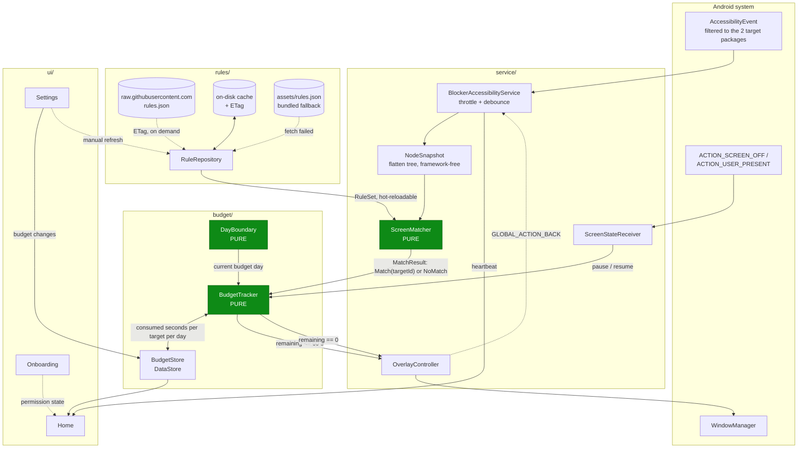

# Architecture

> Target picture. Nothing in this document is implemented yet — it is the contract that the
> milestone issues build against. Deviating from it requires an [ADR](adr/), not a silent change.

## Guiding principle

**Three classes carry all the real logic and none of them touch the Android framework:**

| Class | Responsibility | Depends on |
|---|---|---|
| `ScreenMatcher` | node tree + `RuleSet` → `MatchResult` | Kotlin stdlib only |
| `BudgetTracker` | elapsed-time accounting, pause/resume semantics | Kotlin stdlib only |
| `DayBoundary` | which budget day is it, when does it roll over | `java.time` only |

Everything framework-near is a thin shell around them. `ScreenMatcher` must not see an
`AccessibilityNodeInfo` — the service flattens the tree into a plain data structure first
(`List<NodeSnapshot>`). `BudgetTracker` must not call `System.currentTimeMillis()` — time is
injected as a `Clock`/`TimeSource`. This is what makes the whole core unit-testable without
Robolectric, an emulator or a device.

## Module layout

```
app/
├─ service/
│  ├─ BlockerAccessibilityService.kt   # entry point, event loop, throttling
│  ├─ NodeSnapshot.kt                  # framework-free projection of the node tree
│  ├─ ScreenMatcher.kt                 # node tree → MatchResult (pure, testable)
│  ├─ ScreenStateReceiver.kt           # ACTION_SCREEN_OFF / ACTION_USER_PRESENT
│  └─ OverlayController.kt             # WindowManager, warning chip + blocking overlay
├─ rules/
│  ├─ RuleRepository.kt                # remote fetch + cache + bundled fallback
│  ├─ RuleSet.kt                       # data model (RuleSet / Target / Matcher / Exclusion)
│  └─ assets/rules.json                # fallback copy, bundled into the APK
├─ budget/
│  ├─ BudgetTracker.kt                 # time accounting, pause logic (pure, testable)
│  ├─ BudgetStore.kt                   # DataStore persistence
│  └─ DayBoundary.kt                   # 04:00 reset, timezone- and DST-safe
├─ ui/
│  ├─ home/                            # status, on/off, remaining budget today
│  ├─ settings/                        # per-target budgets, reset time, rule update
│  └─ onboarding/                      # permission flow incl. restricted-settings guidance
└─ di/                                 # Hilt modules
```

`app/` is a single Gradle module. Splitting the pure core into its own Kotlin-only module is
tempting and would enforce the no-framework rule at compile time, but for a project this size one
module with a disciplined package boundary is enough. Revisit with an ADR if the build gets slow.

## Data flow



Green nodes are the framework-free, fully unit-tested core.

## The event loop in detail

1. `accessibility_service_config.xml` restricts events to `com.instagram.android` and
   `com.google.android.youtube` via `android:packageNames`. This filter is the single most
   important battery optimisation in the app — without it the service wakes on every event from
   every app on the device.
2. `TYPE_WINDOW_CONTENT_CHANGED` fires extremely often inside Instagram. The service therefore
   **throttles**: it evaluates at most once per N ms (target: 250–500 ms) and coalesces everything
   in between. `TYPE_WINDOW_STATE_CHANGED` bypasses the throttle because it signals a real surface
   change.
3. `rootInActiveWindow` may be `null` or return a stale hierarchy. Every access is defensive, and a
   `null` root means "no new information", **not** "no match" — otherwise a transient `null` would
   stop the timer while the user is still watching.
4. The flattened `List<NodeSnapshot>` goes to `ScreenMatcher`, which returns
   `MatchResult.Match(targetId, matchedBy)` or `MatchResult.NoMatch`.
5. `BudgetTracker` receives the result. A target counts as active while matches keep arriving, and
   is considered left once no match has arrived for a **grace period** (target: 3 s). The grace
   period stops the timer from stuttering during scroll animations and transient `null` roots.

## Why the timer pauses

R5 requires the budget to run only while the surface is genuinely in the foreground. Three
independent signals feed `BudgetTracker.pause()`:

| Signal | Source | Note |
|---|---|---|
| Different surface / app | no matching events past the grace period | the normal case |
| Screen off | `ScreenStateReceiver` on `ACTION_SCREEN_OFF` | must be registered **at runtime**; a manifest-declared receiver for this action has been ignored since Android 8 |
| Incoming call | the call UI takes the foreground, so matching events stop | covered by the grace period — no telephony permission needed |

Deriving "incoming call" from the absence of events rather than from `READ_PHONE_STATE` keeps the
permission list minimal. R7 is the reason.

## Threading

The service callback runs on the main thread and nothing expensive happens there. Flattening,
matching and budget accounting run on `Dispatchers.Default` inside a service-scoped
`CoroutineScope`. Overlay changes go back to the main thread — `WindowManager` requires it.
DataStore writes are debounced (target: every 5 s while a target is active, plus one final write
when it goes inactive) so an active session does not produce a write per tick.

## Persistence

DataStore only. The complete persistent state is: enabled on/off, per-target budget in minutes,
per-target consumed seconds, the budget day those seconds belong to, and the rule cache metadata.
That is a handful of keys — Room would be overhead. See
[ADR-0002](adr/0002-datastore-over-room.md).

## Testing strategy

| Layer | How |
|---|---|
| `ScreenMatcher` | JUnit5 against recorded node-tree fixtures (real `uiautomator` dumps, checked into `src/test/resources`) |
| `BudgetTracker` | JUnit5 with a virtual clock; Turbine for the emitted state flow |
| `DayBoundary` | JUnit5 with fixed zones, including the DST transitions in `Europe/Berlin` |
| `RuleRepository` | JUnit5 + MockWebServer for the ETag / 304 / failure paths |
| ViewModels | JUnit5 + Turbine; Robolectric only where a `Context` is unavoidable |
| Service integration | **manual**, against `docs/TEST_CHECKLIST.md` — this cannot be meaningfully automated |

## Privacy boundary

- Network: exactly one host, for `rules.json`, and nothing else. No analytics, no crash reporter,
  no third-party SDK beyond the stack listed in the README.
- Accessibility content never leaves the process. Node text is not logged in release builds; the
  debug overlay and verbose match logging are `BuildConfig.DEBUG`-only.
- No screenshots, no `MediaProjection`, no OCR.
